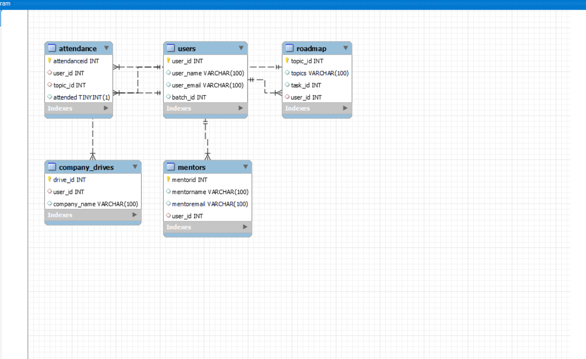

# Database- Day -2: MySQL

## TASK : Design DB model for Guvi Zen class

- Using MySQL to create a database and its associated tables with different values for each of its tables in the database

- Created a new database model called Zen Class

**Created the following Tables as its attributes**
----------------------------------------------------------------
- Users
- Mentors 
- Roadmap
- Roadmap
- Company Drives
----------------------------------------------------------------
**For Each Tables Respective Values are inserted for them**

Users
----------------------------------------------------------------

--------------------------------------------------------------------

Mentors
--------------------------------

 
----------------------------------------------------------------
Roadmap
----------------------------------------------------------------

--------------------------------------------------------------------
Attendance 
--------------------------------

- Here in the attended column of the table you can see its values as **1** which represents that the user has attended the class for that specific topics and vice versa **0** for not attended the class. 
----------------------------------------------------------------

Company Drives
----------------------------------------------------------------

----------------------------------------------------------------

# Representation of the tables connected to the database and respective tables can be seen via er-Diagram

---------------------------------------------------------------

